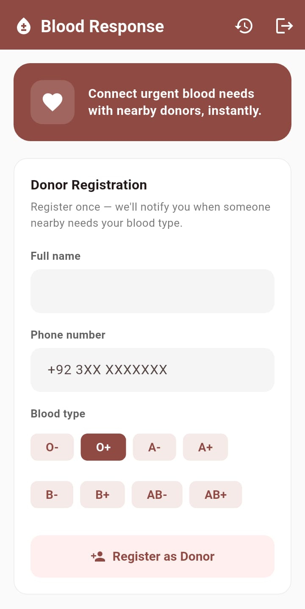
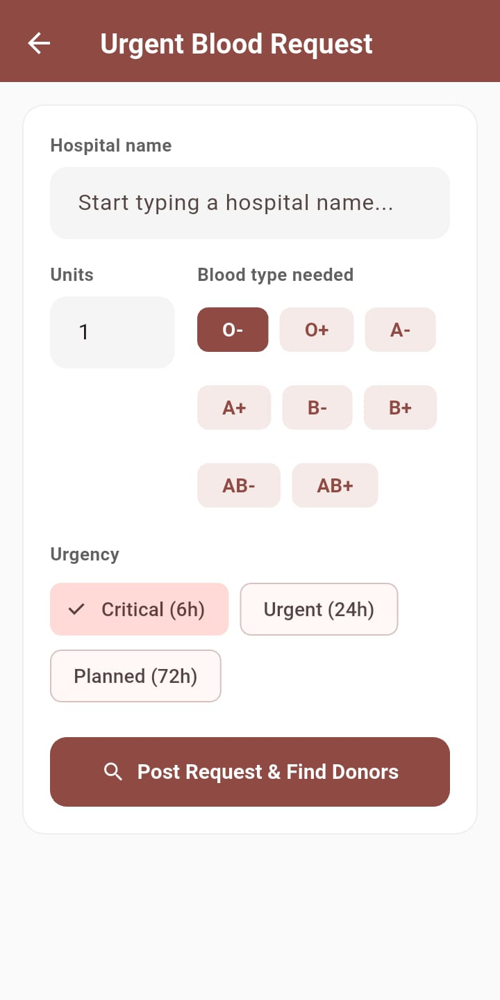
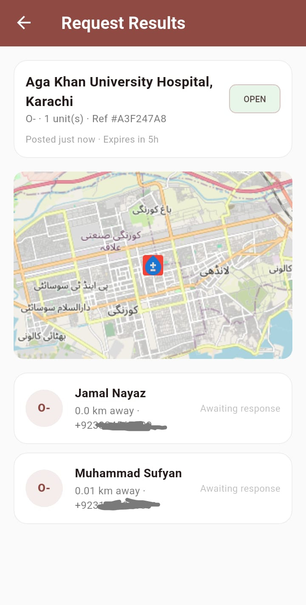

# Blood Response System

A cross-platform mobile app connecting urgent blood donation requesters with nearby, eligible donors in real time — built to close the gap between "blood is needed now" and "a matching donor nearby knows about it."

## The problem

Right now, urgent blood requests spread through WhatsApp forwards — slow, unreliable, and entirely dependent on luck and social reach. Some requests get lucky and reach a donor within the hour. Many don't, and there's no way to know how many people are still waiting when the message never spreads far enough.

Meanwhile, regular donors who *want* to help often have no way to know a real, nearby need exists at the moment they're eligible to give.

This project replaces the WhatsApp-forward model with a direct, location-aware matching system.

## How it works

1. A requester posts an urgent need: blood type, units, hospital, location.
2. The backend finds donors within a radius who have a compatible blood type, are marked available, and are eligible under the 90-day donation rule.
3. Matched donors are shown ranked by distance so the requester can reach out directly.

## Tech stack

- **Mobile:** Flutter (single codebase, iOS + Android + web)
- **Backend:** FastAPI (Python)
- **Database:** PostgreSQL + PostGIS (geospatial donor matching via `ST_DWithin`)
- **ORM/migrations:** SQLAlchemy + GeoAlchemy2 + Alembic
- **Local dev:** Docker Compose

## Project structure

blood-response-system/
├── backend/ # FastAPI app, models, migrations
├── mobile/ # Flutter app
├── docs/ # architecture notes, troubleshooting log
└── docker-compose.yml


## Running it locally

**Backend:**
```bash
cd backend
python -m venv venv
source venv/bin/activate    # Windows: venv\Scripts\activate
pip install -r requirements.txt
cp .env.example .env
cd ..
docker compose up -d
cd backend
alembic upgrade head
uvicorn app.main:app --reload --host 0.0.0.0
```

**Mobile:**
```bash
cd mobile
flutter pub get
flutter run
```

API docs available at `http://127.0.0.1:8000/docs` once the backend is running.

## Current status (feature-complete MVP)

- [x] Phone OTP authentication (JWT) with rate limiting, attempt lockouts, single-active-code invalidation
- [x] Donor registration with blood type, location, and availability toggle
- [x] Urgent blood request creation with urgency-based auto-expiry (critical: 6h, urgent: 24h, planned: 72h)
- [x] Geospatial donor matching (PostGIS) with blood-type compatibility and 90-day eligibility rules
- [x] Donor-initiated browsing of nearby open requests
- [x] Bidirectional push notifications (FCM) — donor on match, requester on acceptance — working across foreground, background, and killed app states with deep-linking
- [x] Donor accept/decline response tracking, plus optional "on my way" status messages
- [x] Donor "I donated" confirmation, correctly resetting the 90-day eligibility window
- [x] Request lifecycle management (fulfilled/cancelled) and full requester/donor activity history
- [x] User reporting and admin ban system, enforced across auth, matching, and notifications
- [x] Hospital name autocomplete, map view of hospital + matched donors, custom app icon/splash
- [x] Unit tests, GitHub Actions CI

## Roadmap

- [ ] Live deployment (pending a free-tier host that doesn't require payment details)
- [ ] Real SMS provider for OTP delivery (currently logs to backend console in dev mode)
- [ ] In-app chat (currently solved via direct phone number sharing between matched users)
- [ ] Government ID verification (would require a paid NADRA-equivalent integration)

## Notes on data sensitivity

This app handles health-adjacent personal data (blood type, real-time location, donation history). The MVP is a learning/portfolio project and does not yet implement production-grade data protection — see Roadmap. Any real deployment would need consent flows for location sharing and data minimization review before handling real users' data.

## Background

Built as an internship project for Alkhidmat Foundation's IT Department, with an emphasis on following industry-standard practices (env separation, migrations, containerized dev, version control hygiene) as a portfolio piece.

See `docs/TROUBLESHOOTING.md` for real issues hit and resolved during development (PostGIS/Alembic quirks, Docker port conflicts, etc.).

## Screenshots

| Register | Post Request | Matches |
|---|---|---|
|  |  |  |

**Live demo:** Not yet deployed — see note below.

## Running it locally

This project runs via Docker Compose + Uvicorn locally (see setup instructions above).
Live deployment is on the roadmap, pending a hosting provider that doesn't require
payment details for a free-tier student/portfolio project. The backend is fully
containerized and deploy-ready (Docker + Alembic migrations + env-based config),
so standing it up on any PaaS is a configuration step away, not a code change.

